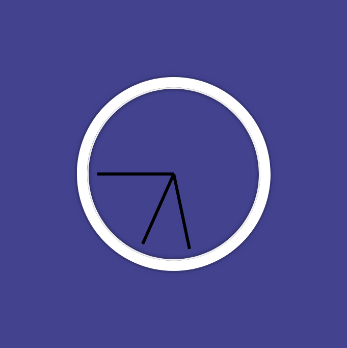

# Project 2 -

Analog Clock Project

This project features an analog clock created using HTML, CSS, and JavaScript. The clock displays the current time with rotating hour, minute, and second hands, providing a visually appealing representation of the current time.

## Structure

- The HTML file (index.html) sets up the structure of the analog clock.
- The CSS file (styles.css) defines the styling for the clock hands and the clock face.
- JavaScript (script.js) is responsible for dynamically updating the rotation angles of the clock hands based on the current time.

## How It Works

- The DOMContentLoaded event is utilized to ensure that the DOM elements are fully loaded before JavaScript execution begins.
- The rotateClockHand function calculates the rotation angles for the hour, minute, and second hands based on the current time.
- he requestAnimationFrame function is used to call rotateClockHand based on the user screen repaint cycle, ensuring real-time updates.

## Screenshot

## Live Site

[Click here](https://657f5db71ade912a7246daba--fabulous-alpaca-56474c.netlify.app/) to access the live site
