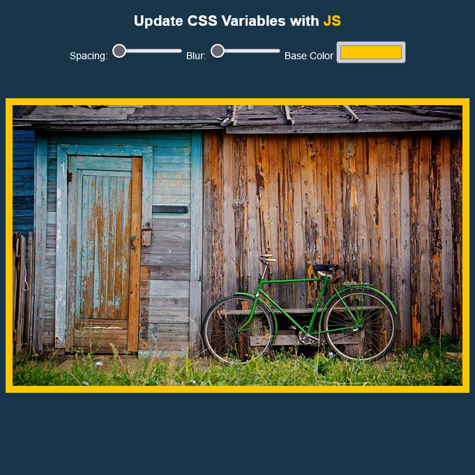

# Scoped CSS Variables and JS

This project demonstrates the use of Scoped CSS Variables and JavaScript to dynamically update CSS properties based on user input.

## Table of Contents

- [Overview](#overview)
- [Structure](#structure)
- [How It Works](#how-it-works)
- [Screenshot](#screenshot)
- [Live Site](#live-site)
- [Lessons Learned](#lessons-learned)

## Overview

The project allows users to interact with range inputs for spacing and blur, as well as a color input for the base color. JavaScript dynamically updates CSS variables, providing real-time visual feedback to users as they adjust the input values.

## Structure

- **HTML File (index.html):** Contains range inputs for spacing and blur, a color input for the base color, and an image.
- **CSS File (styles.css):** Defines styles, including scoped CSS variables.
- **JavaScript (script tag in index.html):** Handles user input events and updates CSS variables accordingly.

## How It Works

- The JavaScript script listens for 'change' and 'mousemove' events on the input elements.
- When an event occurs, the `handleUpdate` function is called.
- The function retrieves the `data-sizing` attribute (if present) and uses it as a suffix for the CSS property.
- CSS variables are updated dynamically, reflecting changes in spacing, blur, and color.

## Screenshot

## Live Site

[Explore the live site](#) to interact with the project and witness real-time updates.

## Lessons Learned

During the development of this project, key lessons were learned:

- Establishing connections between HTML elements.
- Utilizing the 'data-' attribute in HTML for creating custom attributes.
- Accessing custom attributes using the `.dataset` method in JavaScript.
- Dynamically updating CSS variables for responsive and interactive designs.

Feel free to explore and experiment with the Scoped CSS Variables and JS project!
