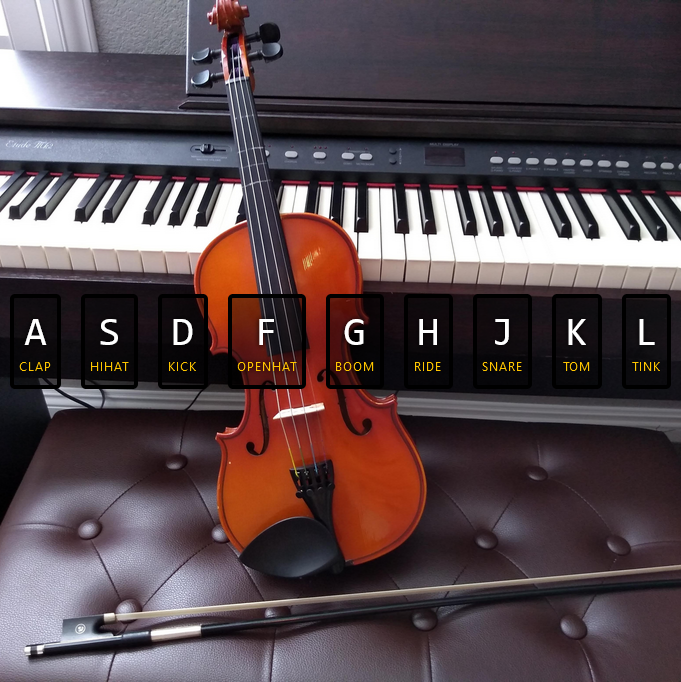

# Project 1 - Javscript Drum Kit

This is an interactive JavaScript Drum Kit that allows you to play different drum sounds using your computer keyboard. Each Home row key corresponds to a specific drum sound, and when pressed, the corresponding sound is played along with a visual effect on the screen.

## Structure

- The HTML file (index.html) contains a set of keys, each associated with a specific drum sound.
- The CSS file (styles.css) provides styling for the keys and the visual effects when a key is pressed.
- Drum sounds are stored in the audio folder.

## How It Works

- The keydown event listener is used to detect key presses.
- When a key is pressed, the corresponding audio element is selected using JavaScript.
- The audio playback is triggered, and a visual effect is applied to the associated key element.

## Screenshot

## Live Site

[Click here]() to access the live site
